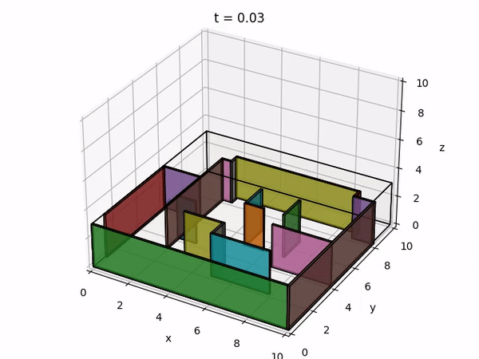
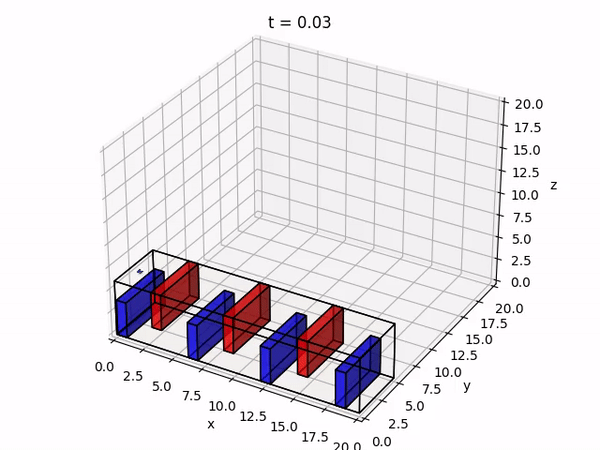
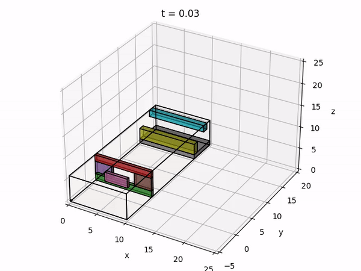

# Quadrotor-Control
This's a course project for UPenn MEAM 620.

cd <your workspace>/meam620-2020\
run "pip install -e ." to setup the required packages including: cvxopt, matplotlib, numpy, scipy and timeout_decorator.\
Recommend Python 3.6\
Then cd <your workspace>/meam620-2020/proj1_3/code\
run sandbox.py to view the demo.

